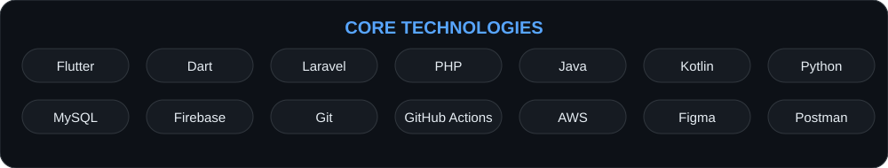

 

  

---

## 👨‍💻 About Me

I'm an **Associate Software Engineer and Full-Stack Mobile Developer** focused on building production-ready cross-platform applications using **Flutter, Dart, Laravel, PHP, REST APIs, Firebase, and relational databases**.

- 🚀 Associate Software Engineer — **Genioux Pvt Ltd**, World Trade Centre, Sri Lanka
- 📱 2+ years of software development experience with Flutter and Laravel
- 🎓 BSc (Hons) Software Engineering — ICBT Campus, affiliated with Cardiff Metropolitan University
- 📊 BBA — Business Analytics specialization, University of Sabaragamuwa
- 🧩 HNDIT — SLIATE, GPA 3.34
- 🔐 Diploma in Cybersecurity & Ethical Hacking — SITC Campus, Grade A+
- 🏢 Founder — **Velocity Stack Solution**
- 🇱🇰 Gampaha, Sri Lanka

## 💼 Professional Experience

| Period | Position | Organization |
|---|---|---|
| **Dec 2024 – Present** | Associate Software Engineer — Full-Stack Mobile Developer | **Genioux Pvt Ltd** |
| **May 2024 – Nov 2024** | Intern QA Engineer | **Laptop.lk** |
| **Aug 2020 – Aug 2021** | Junior Bancassurance Executive | **LOLC Holdings** |

### What I work on

- Cross-platform mobile application development with **Flutter**
- Backend development using **Laravel / PHP**
- RESTful API design and integration
- Authentication and authorization using **JWT**
- Firebase Authentication, Firestore, Realtime Database and FCM
- MySQL database design and API synchronization
- Responsive and accessible mobile UI development
- Third-party API integrations
- Git/GitHub workflows and CI/CD
- Collaboration with UI/UX and cross-functional teams

## 🛠️ Tech Stack

  

  

## 🚀 Featured Projects

### 🍳 CulinaryArt
**Role:** Full-Stack Developer

Flutter + Laravel mobile application with role-based access, GRN workflows, budget validation and business-oriented application workflows.

**App Store:** [CulinaryArt](https://apps.apple.com/lk/app/culinaryart/id6742330432)

---

### 🔎 VERIFIND — AI Lost & Found Matchmaking System
**Role:** Full-Stack Developer / Dissertation Project

An AI-driven lost-and-found matchmaking system designed around privacy, multimodal matching and graceful degradation.

**Technology:** Flutter · Laravel 11 · Python FastAPI · PostgreSQL/Supabase · PostGIS · AI services · REST APIs

Key concepts include:

- Multimodal lost/found item matching
- Context-aware graceful degradation
- Location-aware matching
- Secure authentication
- Privacy-focused in-app communication
- AI-assisted content analysis and moderation

---

### 🇱🇰 SL Guide
**Role:** Flutter Engineer

Smart Sri Lankan travel guide integrating hotel booking, Google Maps, AI-powered search and a Laravel backend.

**Website:** [slquide.kingsrilankatours.com](https://slquide.kingsrilankatours.com/)

---

### 📍 Habibi Travel Location App
**Role:** Android Developer

Native Android application built with Java, Firebase Firestore, Firebase Realtime Database and Google Maps for live location and travel-related functionality.

**Repository:** [Habibi Travel Location](https://github.com/DilakshaDissanayake/Habibi-Travel-Location-)

**Demo:** [YouTube](https://youtu.be/bis7EE-6zQk)

---

### 🛒 D-Mart Online Store
**Role:** Android Developer

Java-based e-commerce application featuring order tracking and sandbox payment gateway integration.

**Repository:** [D-Mart Online Store](https://github.com/DilakshaDissanayake/d-mart-online-store)

## 📜 Certifications

- 🎓 Diploma in Cybersecurity & Ethical Hacking — **SITC Campus — Grade A+**
- 🔐 Introduction to Cybersecurity — **Cisco Networking Academy**
- 🔌 API Fundamentals — **Postman Student Program**
- 🌐 Web Design for Beginners — **CODL, University of Moratuwa**
- 💻 Computer Application Assistant — **Nanasala Sri Lanka**

## 📊 GitHub

  

> GitHub's native profile page provides the live contribution calendar and repository activity, so this README intentionally avoids third-party dynamic analytics that can disappear when external services are unavailable.

## 🤝 Let's Connect

Interested in **mobile development, backend architecture, REST APIs, AI integration, cybersecurity, or software projects**?

  

  

